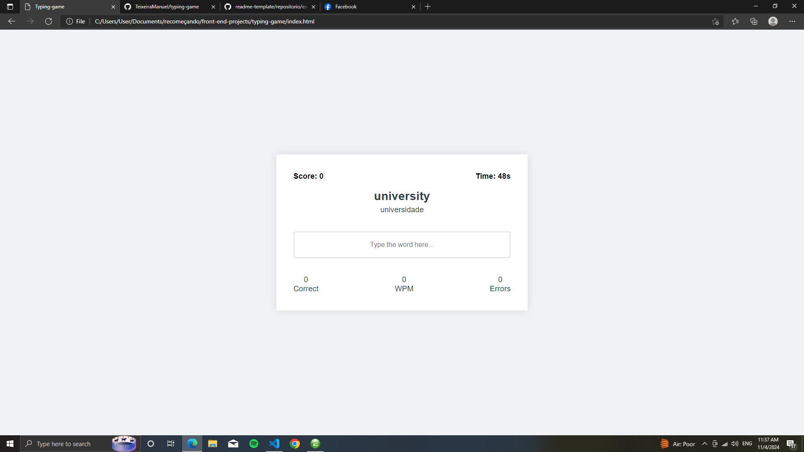

# Typing game

> typing game é um projecto que criei para me ajudar nos meus estudos em inglês. Ele serve basicamente para conhecer algumas palavras novas em inglêss

## 💻 Pré-requisitos

Antes de começar, verifique se você atendeu aos seguintes requisitos:

- Algum navegador
